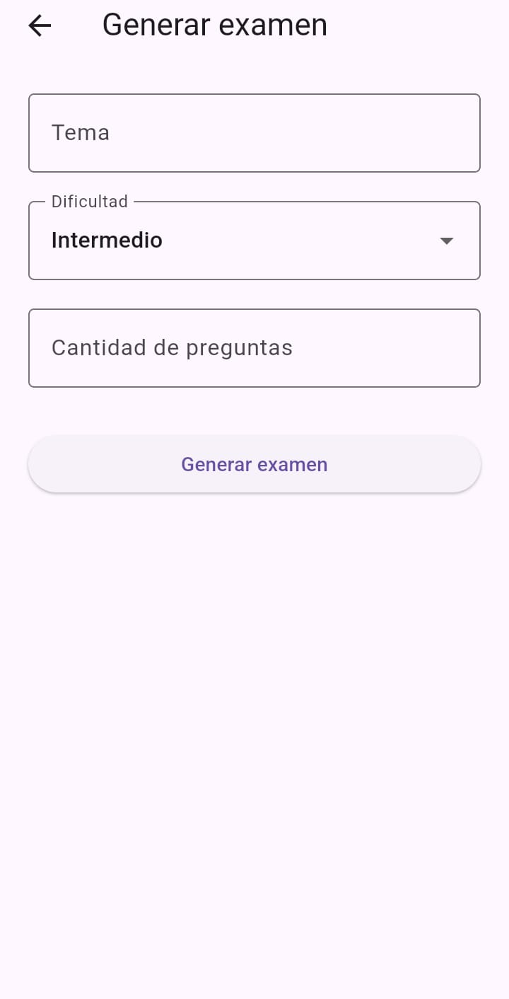
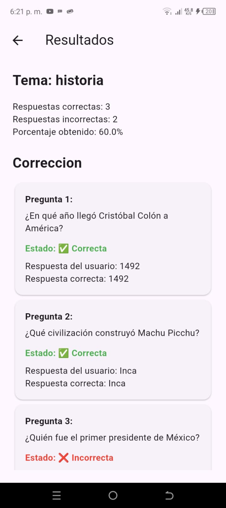
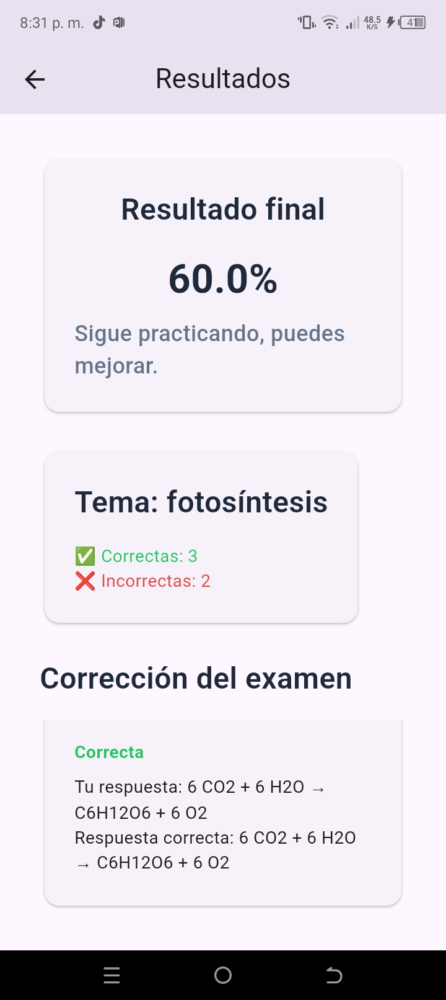

# StudyAI

StudyAI is an educational mobile application built with **Flutter and Dart** that uses artificial intelligence to generate personalized exams based on a topic chosen by the user.

The project was created as an exploration of how to integrate artificial intelligence services into a mobile application and turn AI-generated content into an interactive educational experience.

## Features

StudyAI allows users to:

* Enter a topic they want to study.
* Configure the characteristics of the exam.
* Generate questions using artificial intelligence.
* Take the exam through an interactive interface.
* Record and evaluate their answers.
* Automatically calculate their score.
* Review their results and correct answers.

### Application Flow

```text
Study Topic
      ↓
Exam Configuration
      ↓
Request to AI API
      ↓
Question Generation
      ↓
Interactive Exam
      ↓
Evaluation
      ↓
Results
```

## Technologies Used

* **Flutter** — Framework used to build the cross-platform mobile application.
* **Dart** — Main programming language.
* **OpenRouter API** — Service used as an intermediary to access the AI model responsible for generating the exams.
* **HTTP** — Used to make requests to the AI API.
* **flutter_dotenv** — Used to manage environment variables and API credentials.
* **JSON** — Format used to send and receive data between the application and the API.
* **Visual Studio Code** — Development environment used throughout the project.

## Architecture

The application uses a simple structure based on separation of responsibilities:

```text
lib/
├── models/
│   └── exam.dart
│
├── services/
│   └── ai_service.dart
│
└── screens/
    ├── generate_exam_screen.dart
    ├── exam_screen.dart
    └── result_screen.dart
```

### Models

Contains the data structures used by the application, including exams, questions, and answers.

### Services

Contains logic related to external services.

`AiService` is responsible for communicating with the artificial intelligence API and transforming the received responses into data that can be used by the application.

### Screens

Contains the different interfaces that make up the main StudyAI flow:

* `GenerateExamScreen` — Exam configuration and generation.
* `ExamScreen` — Interactive exam interface.
* `ResultScreen` — Results and answer review.

## Screenshots

<p align="center">
  
  
  
</p>

## Project Status

**Status: Functional MVP / Archived**

StudyAI reached a functional MVP capable of generating and delivering AI-powered exams.

The application was tested with multiple real exam generations to evaluate its behavior and identify technical and user experience issues.

The project is currently archived and is no longer under active development.

## Known Limitations

### Connection Reliability

Some API requests may fail and, in certain cases, multiple attempts may be required before receiving a successful response.

Potential improvements include:

* Better timeout configuration.
* Automatic retry mechanisms.
* More robust error handling.
* Improved feedback for users when a request fails.

### Results Review Experience

The results screen fulfills its basic purpose, but reviewing answers can currently feel somewhat cumbersome.

A future iteration could redesign this section to present correct and incorrect answers in a clearer and more interactive way.

### AI Generation Quality

The AI generation works well with general and commonly known topics. However, highly specific topics may result in inaccurate or fabricated information.

Potential improvements include:

* Improving the prompts used to generate exams.
* Adding additional content validation.
* Integrating external sources.
* Exploring search-based or **RAG (Retrieval-Augmented Generation)** architectures.

## Setup

To run StudyAI locally, the required credentials for the AI service must be provided.

API keys and other credentials are managed through environment variables and **are not included in this repository**.

For security reasons, API keys should never be hardcoded into the source code or committed to GitHub.

## Project Goals

StudyAI was developed as a practical project to explore:

* Mobile application development with Flutter.
* Integration with external APIs.
* Consumption of artificial intelligence services.
* JSON data processing.
* Separation of responsibilities within an application.
* Designing an educational experience around AI-generated content.

---

**StudyAI — Flutter + Dart + AI**
